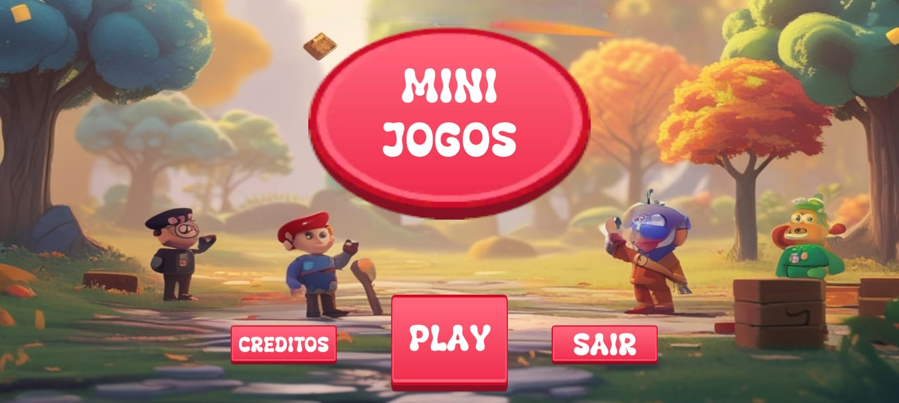
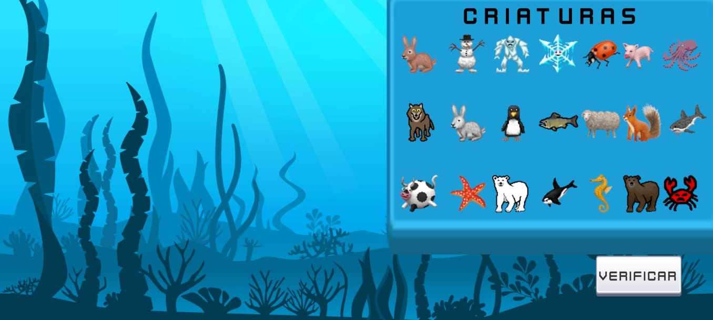
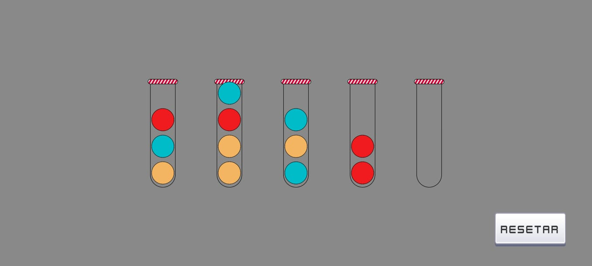
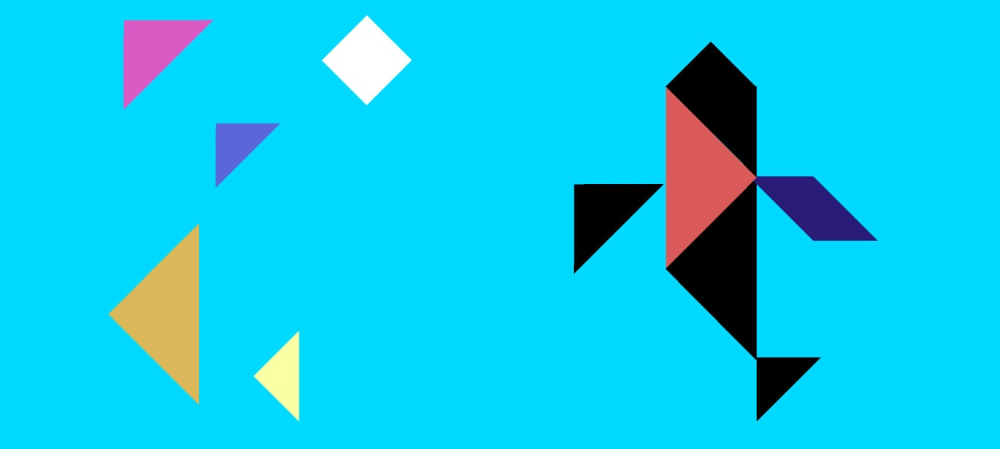
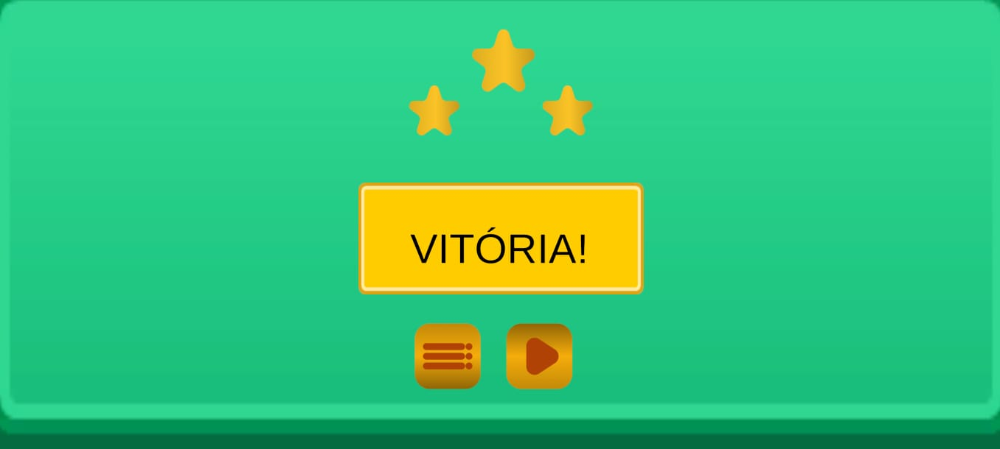
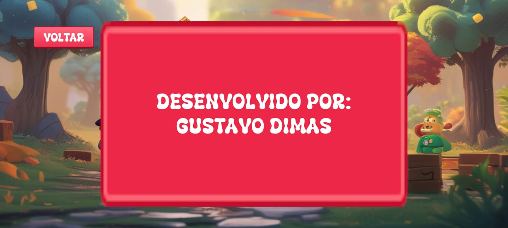

# Jogos Acessíveis – Protótipo

---

## Sobre o Projeto

O projeto **Jogos Acessíveis** é um protótipo criado na Unity, com foco em acessibilidade e inspirado em brinquedos pedagógicos. O objetivo é adaptar jogos clássicos de estimulação cognitiva para o meio digital, facilitando o acesso de crianças autistas ou com outras necessidades especiais. O protótipo utiliza assets gratuitos do itch.io e formas básicas da Unity.

---

### Menu Inicial

- **Imagem:** Ilustração de fundo feita por IA (Leonardo.AI), com crianças e cenário lúdico e colorido.
- 

---

## Minijogos Disponíveis

### 1. Mural Criativo RPG

Adaptação digital do mural criativo Montessori. O jogador arrasta criaturas de RPG para os biomas corretos, estimulando associação visual e categorização.

- **Inspiração:** [Mural Criativo Montessori – LKStoreImports](https://www.lkstoreimports.com/products/mural-criativo-montessori?currency=BRL&variant=41662463541453&utm_source=google&utm_medium=cpc&utm_campaign=Google%20Shopping&stkn=2a9c3f1375a2&gad_source=1&gclid=Cj0KCQjwsoe5BhDiARIsAOXVoUt-K2s5XrxRlYVZ0ZPmzJ_1px0LHRDkEsGat5BVKexqjWhm7oh79XsaAqOrEALw_wcB)
- **Imagem:** Screenshot do Mural Criativo com um cenário aquático e uma painel com as criaturas. 
- 

---

### 2. Ball Sort (Organizador de Cores)

Inspirado em brinquedos de tubos e bolas, o objetivo é separar todas as bolas por cor, organizando-as nos tubos corretos.

- **Inspiração:** [Jogo Montessori Educativo Bolas e Copos – BrinquedosParaAutismo](https://brinquedosparaautismo.com.br/collections/brinquedos-para-autismo-5-anos/products/jogo-montessori-educativo-bolas-e-copos)
- **Imagem:** Screenshot do Ball Sort com tubos e bolas coloridas.
- 

---

### 3. Tangram da Baleia

Versão digital do tangram, onde o jogador deve montar a silhueta de uma baleia com formas geométricas.

- **Inspiração:** [Quebra-Cabeça Cognitivo – MajocaColore](https://majocacolore.com.br/produto/quebra-cabeca-com-alfabeto-e-numeros-braquiossauro)
- **Imagem:** Screenshot do Tangram formando a baleia.
- 

---

## Outras Telas

### Tela de Vitória

- **Imagem:** Inspirada em jogos Flash: tela com 3 estrelas representando a vitória do jogador.
- 

---

## Créditos

- **Desenvolvimento:** Gustavo Dimas
- **Orientação:** Luiz Machado (Coordenardor do Curso de Jogos Digitais e Professor de Acessibilidade em Jogos Digitais)
- **Inspirações:** Brinquedos pedagógicos de diversas lojas especializadas
- **Assets:** itch.io (gratuitos para prototipagem)
- 
---

## Tecnologias Utilizadas

- Unity (Game Engine)
- Assets gratuitos do itch.io
- Leonardo.AI (imagem de fundo do menu)
- Adobe Illustrator (para edição de artes, se necessário)

---

> **Observação:**  
> Este projeto é um protótipo em fase inicial, com foco em testar ideias de adaptação de brinquedos acessíveis para o ambiente digital.